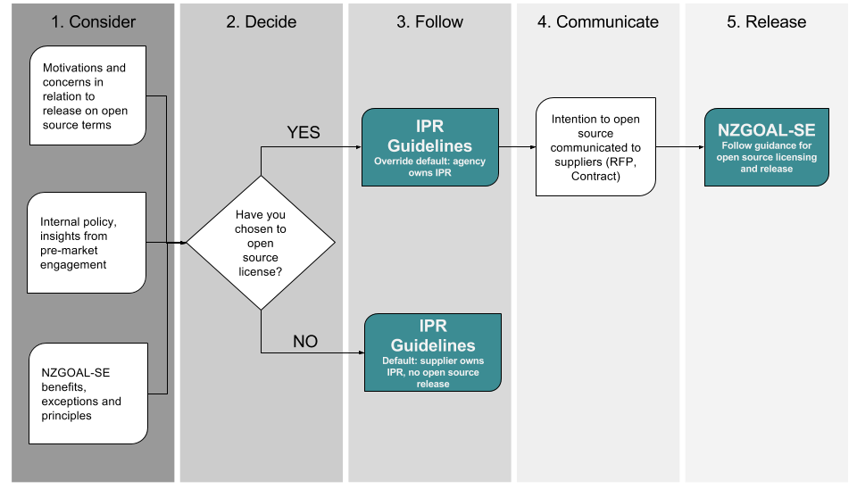

## Why is this guidance needed?
4. When considering development of custom software from a supplier there
are two policy documents to consider:

 a. [Guidelines for Treatment of Intellectual Property Right in ICT
    Contracts (2008)](https://www.ict.govt.nz/guidance-and-resources/open-government/procurement-advice/guidelines-for-the-treatment-of-intellectual-property-rights-in-ict-contracts/) -
    this is referred to in the Government Rules of Sourcing, rule 61 and
    we will refer to these as the "IPR Guidelines" from now on in
    this guidance. The IPR Guidelines help agencies determine who should
    own the copyright in newly developed software code by a supplier.

 b. [New Zealand Government Open Access and Licensing framework -
    Software
    Extension (2016)](https://www.ict.govt.nz/guidance-and-resources/open-government/new-zealand-government-open-access-and-licensing-nzgoal-framework/nzgoal-se/) -
    we will refer to this as "NZGOAL-SE" from now on in this guidance.
    NZGOAL-SE helps agencies correctly license publicly funded software
    code using an open source licence when they have decided to do so.

5. The IPR Guidelines default position is that suppliers should own the
copyright in newly developed software code. The reasoning is that the
government is not in the business of commercialising software. In
certain limited situations the default can be overridden, one of these
being that *"the agency intends to allow free use of the \[software\] on
open source terms"*[^1]. Open source licensing allows commercialisation
opportunities of software code by anyone under the open source licence
terms.

6. If an agency decides *"yes, we intend to allow free use on open source
terms"* then the IPR Guidelines recognise that an agency may wish to own
new intellectual property rights in the software that is to be procured.
This can be important because, as the NZGOAL-SE review and release
process notes, an agency that wishes to release software under an open
source software licence needs to consider whether it has sufficient
rights to do so. If the agency owns the intellectual property rights in
the software and has not exclusively licensed it to someone else, it
usually will have sufficient rights. In some cases the same result might
be achieved by obtaining a sufficiently broad licence from the supplier
that allows release on open source terms but this path can be more
complicated and involve more paper work.

7. The IPR Guidelines do not contain guidance on what to consider when
deciding whether to release software under an open source software
licence. They also contain little guidance as to when and how to
communicate to suppliers an agency’s intention to release procured
software on open source terms (as that was not their purpose). These two
aspects are addressed in this Guidance Note.

8. The following diagram demonstrates how agencies can respect the IPR
Guidelines during a software procurement while incorporating a decision
to release the procured software under an open source software licence.
Note that it only considers the interaction between the IPR Guidelines
and release of software on open source terms under NZGOAL-SE. There may
be other reasons as to why an agency wishes to own procured software but
they are not relevant to this Guidance Note.

[^1]: IPR Guidelines, p. 13. See
    [https://www.ict.govt.nz/guidance-and-resources/open-government/procurement-advice/guidelines-for-the-treatment-of-intellectual-property-rights-in-ict-contracts/decision-process-for-determining-ownership-and-commercialisation/](https://www.ict.govt.nz/guidance-and-resources/open-government/procurement-advice/guidelines-for-the-treatment-of-intellectual-property-rights-in-ict-contracts/decision-process-for-determining-ownership-and-commercialisation/)
